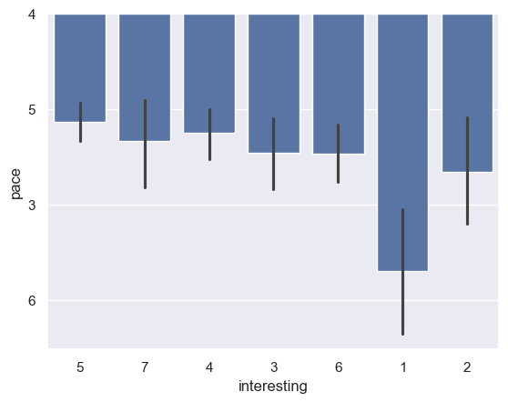

---
# Do not edit the text between these lines!
layout: default
---

# COMP 110 shoud slow the pace of its teaching

<!-- This is a comment. Below, you'll see code for inserting an image. To make this image appear, update <custom-path>. To add an image, save it inside the imgs folder of this repository. -->
## Class evidence supports this
/static/imgs/image.png" alt="Evidence "  width="500"/>

This data does support my idea. The data shows that those who rate the class as least interesting also rate tha class with the highest pace. My recommendation would be to slow down the pace of the class with more time for each topic to ensure students are engaged. To make more time, this class can have additional readings so students can learn more content. The potential costs could be the amount of content covered since spending more time on topics could result in less content covered for the students. This harms students due to their lack of knowledge on cut topics and employers since they have to fill in the gaps. 